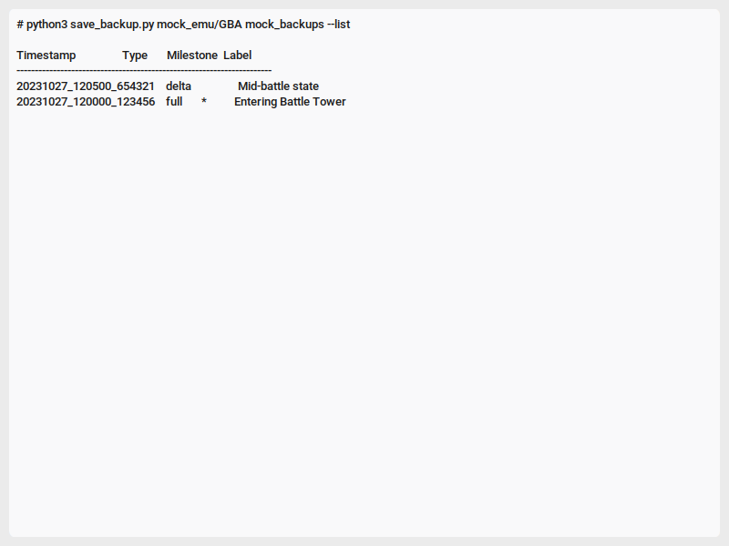

# Nintendo Retro Utility Suite

A comprehensive collection of tools for Nintendo emulation enthusiasts, focusing on automated save synchronization, intelligent backups, real-time translation, and ROM management.

## 🚀 Featured Utilities

### 1. PokeSync - Universal Save Sync
Automate your save file backups to a private GitHub repository. Supports multiple platforms and emulators with a sleek mobile-inspired dashboard and a flexible CLI.

**Features:**
- **Modern Dashboard:** Search, filter by platform, and access recommended games instantly.
- **Cross-Platform:** Works with Citra (3DS), Ryujinx/Yuzu (Switch), and GBA emulators.
- **GitHub Integration:** Sync your progress across multiple devices using Git.
- **Automated Discovery:** Automatically scans common emulator paths to find your games.

<div align="center">
  <table style="width:100%; border-collapse: collapse; border: none;">
    <tr>
      <td style="padding: 10px; width: 50%;"></td>
      <td style="padding: 10px; width: 50%;"></td>
    </tr>
    <tr>
      <td style="padding: 10px; width: 50%;"></td>
      <td style="padding: 10px; width: 50%;"></td>
    </tr>
  </table>
  <p><i>The new "Glass-Morphism" interface featuring a dark theme, cyan accents, and responsive layout.</i></p>
</div>

### 🎮 Supported Emulators
Nintendo emulators include **Dolphin** (GameCube/Wii), **Cemu** (Wii U), **Yuzu/Eden/Citron** (Switch), **melonDS/DeSmuME** (DS), **Azah/Citra** (3DS), and **mGBA** (Game Boy). These allow playing Nintendo games on PC, Android, and Steam Deck. Other notable options include **Nestopia** (NES), **Project64** (N64), and multifunctional emulators like **RetroArch/Libretro**.

**Usage (GUI):**
```bash
python main.py
```

**Usage (CLI):**
```bash
python main.py --list
python main.py --push <game_id> --platform <platform>
```

---

### 2. AI-Powered Save-State Backup
A localized version-control service for emulation progress that goes beyond simple file copying.

**Features:**
- **AI Scene Recognition:** Automatically generates descriptive labels for your saves using the `Salesforce/blip-image-captioning-base` model by analyzing companion screenshots.
- **Delta Compression:** Uses `xdelta3` to save space by only storing changes between saves.
- **Milestone Retention:** Automatically identifies "important" saves (significant file size deltas) and protects them from pruning.
- **Performance Aware:** Throttles operations if system CPU usage is too high.

**Usage:**
```bash
python save_backup.py /path/to/saves /path/to/backups --extensions .sav .dsv --use-delta
```

---

### 3. Omni-Translate Framework
A modular framework for automating the translation of Nintendo ROMs across generations.

**Platforms:**
- **Cartridge:** NES, SNES, N64 (Binary scanning + TBL support).
- **Disc:** GameCube, Wii (Shift-JIS scanning).
- **Handheld:** 3DS, Wii U (MSBT parsing/injection).

**Workflow:**
1. **Extract:** `python omni.py --platform handheld --file game.msbt`
2. **Translate:** `python omni.py --platform handheld --file game.msbt --translate --model llama3`
3. **Inject:** `python omni.py --platform handheld --file game.msbt --inject --output translated.msbt`

---

### 4. Game Translator Utility (macOS)
Provides a real-time English overlay for Japanese games using OCR and local LLMs.

**Features:**
- Japanese OCR via Tesseract.
- Natural translation via Ollama (local LLM).
- Transparent, always-on-top window that tracks the emulator window position.

**Prerequisites:**
- `brew install tesseract tesseract-lang`
- Ollama running locally.

---

### 5. macOS ROM Tagger
Enhance your ROM library with native macOS metadata and Finder tags.

**Features:**
- Injects `kMDItemTitle` and `kMDItemIdentifier` from ROM headers.
- Applies Finder Color Tags (Green for GBA, Purple for GC/Wii).
- Forces Spotlight indexing for instant searching.

**Usage:**
```bash
python mac_rom_tagger.py --dir /path/to/roms
```

## 🛠 Installation

1. Clone the repository:
   ```bash
   git clone https://github.com/your-repo/nintendo-util-suite.git
   cd nintendo-util-suite
   ```
2. Install dependencies:
   ```bash
   pip install -r requirements.txt
   ```
3. (Optional) Install external binaries:
   - **xdelta3** (for delta backups)
   - **Tesseract** (for the translator)
   - **Ollama** (for AI translations)

## 📜 License
This project is licensed under the MIT License.
