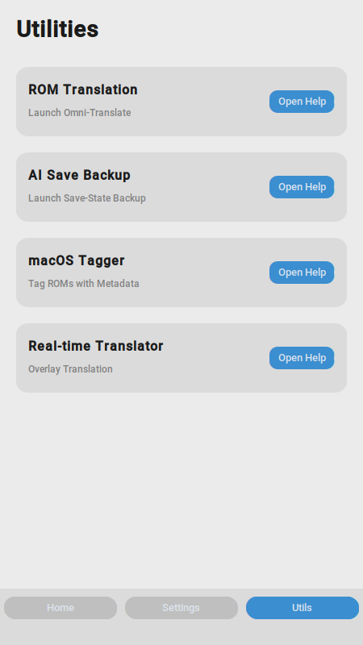
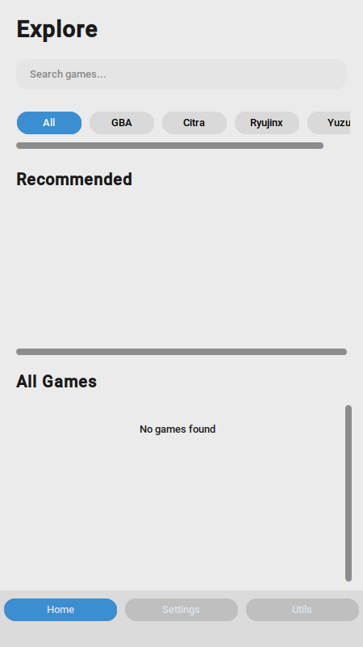
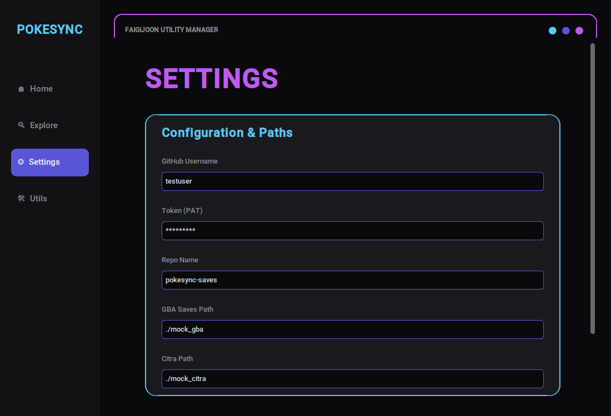

# OmniNexus

A comprehensive collection of tools for Nintendo emulation enthusiasts, focusing on automated save synchronization, intelligent backups, real-time translation, and ROM management.



---

## Featured Utilities

### 1. PokeSync - Universal Save Sync
Automate your save file backups to a private GitHub repository. Supports multiple platforms and emulators with a sleek, high-fidelity dashboard built using the Faigijoon design language.



**Features:**
*   **Glassmorphism UI**: A stunning interface featuring a deep obsidian background (#0A0A0C) with electric purple and neon cyan accents.
*   **Modern Dashboard**: Search and filter by platform with interactive chips, and access recommended games instantly.
*   **Cross-Platform**: Works with Citra (3DS), DeSmuME (DS), Ryujinx/Yuzu (Switch), and GBA emulators.
*   **GitHub Integration**: Sync your progress across multiple devices using Git.
*   **Automated Discovery**: Automatically scans common emulator paths to find your games.



**Usage (GUI):**
```bash
python main.py
```

**Usage (CLI):**
```bash
python main.py --list
python main.py --push <game_id> --platform <platform>
```

### Why Git for Saves?
OmniNexus uses Git not just for code, but as a high-fidelity engine for your game saves:
*   **Time Travel**: Corrupted your save? Use Git history to roll back to any previous state.
*   **Atomic Sync**: Keeps your save files, screenshots, and metadata perfectly in sync across all your devices.
*   **Conflict Resolution**: Prevents accidental overwrites if you play on two different devices without syncing first.
*   **Private & Secure**: Your saves stay in your own private GitHub repository, giving you full ownership of your data.

---

### 2. AI-Powered Save-State Backup
A localized version-control service for emulation progress that goes beyond simple file copying.

**Features:**
*   **AI Scene Recognition**: Automatically generates descriptive labels for your saves using the Salesforce/blip-image-captioning-base model by analyzing companion screenshots.
*   **Delta Compression**: Uses xdelta3 to save space by only storing changes between saves.
*   **Milestone Retention**: Automatically identifies important saves based on significant file size deltas and protects them from pruning.
*   **Performance Aware**: Throttles operations if system CPU usage is too high.

**Usage:**
```bash
python save_backup.py /path/to/saves /path/to/backups --extensions .sav .dsv --use-delta
```

---

### 3. Omni-Translate Framework
A modular framework for automating the translation of Nintendo ROMs across generations.

**Platforms:**
*   **Cartridge**: NES, SNES, N64 (Binary scanning and TBL support).
*   **Disc**: GameCube, Wii (Shift-JIS scanning).
*   **Handheld**: 3DS, Wii U (MSBT parsing and injection).

**Workflow:**
*   **Extract**: `python omni.py --platform handheld --file game.msbt`
*   **Translate**: `python omni.py --platform handheld --file game.msbt --translate --model llama3`
*   **Inject**: `python omni.py --platform handheld --file game.msbt --inject --output translated.msbt`

---

### 4. Game Translator Utility (macOS)
Provides a real-time English overlay for Japanese games using OCR and local LLMs.

**Features:**
*   Japanese OCR via Tesseract.
*   Natural translation via Ollama (local LLM).
*   Transparent, always-on-top window that tracks the emulator window position.

**Prerequisites:**
*   `brew install tesseract tesseract-lang`
*   Ollama running locally.

---

### 5. macOS ROM Tagger
Enhance your ROM library with native macOS metadata and Finder tags.

**Features:**
*   Injects kMDItemTitle and kMDItemIdentifier from ROM headers.
*   Applies Finder Color Tags (Green for GBA, Purple for GC/Wii).
*   Forces Spotlight indexing for instant searching.

**Usage:**
```bash
python mac_rom_tagger.py --dir /path/to/roms
```

---

## Installation

**Clone the repository:**
```bash
git clone https://github.com/your-repo/OmniNexus.git
cd OmniNexus
```

**Install dependencies:**
```bash
pip install -r requirements.txt
```

**(Optional) Install external binaries:**
*   xdelta3 (for delta backups)
*   Tesseract (for the translator)
*   Ollama (for AI translations)

---

## License
This project is licensed under the MIT License.

---

### Suggested Names for the Repo
*   **OmniNexus**: Suggests a central hub for all emulation needs.
*   **FaigiSuite**: Highlights the unique design language used for the tool.
*   **EmuFlow**: Focuses on the seamless synchronization and translation workflow.
*   **RetroLink**: Emphasizes the connection between different platforms and GitHub.
